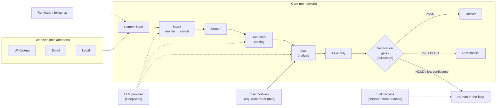
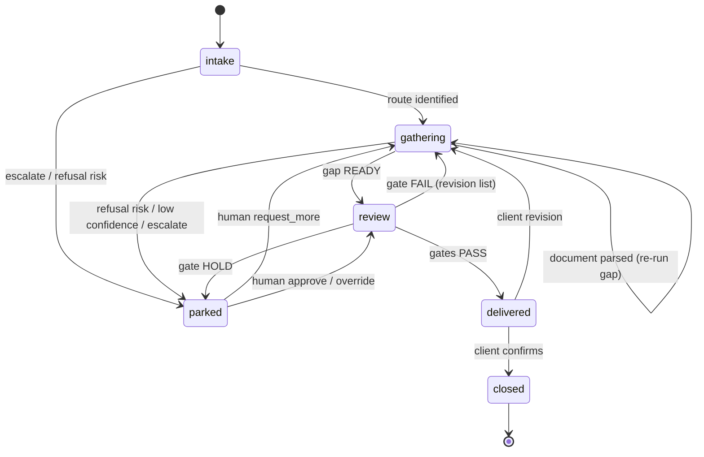

# uk-visa-consultant

A human-like UK visa application consultant agent. It interacts with clients over WhatsApp and email the way a human consultant would — intake, document gathering, gap analysis, reminders, and final assembly of a submission-ready application package — and **delivers the result**, not just advice.

Built **delivery-stability-first**: every agent boundary uses structured output, every deliverable passes a fail-closed verification gate before it ships, and every claim carries provenance. The core is channel-agnostic and fully testable over a **local message loop** (no network) before any WhatsApp/email integration exists.

## What this repository contains

Two intertwined deliverables:

1. **The product** — a consultant agent that takes a client from *"I want a UK visa"* to a complete, checked application package (form data, document checklist, cover letter, indexed supporting documents).
2. **The thesis** — how to make AI delivery stable: agent selection, workflow design, structured outputs, evaluation gates, exact-intent recovery, and human escalation. Written up in [`docs/STABILITY.md`](docs/STABILITY.md).

## Visa routes (each its own module)

| Module | Route | Status |
|---|---|---|
| `visas/visitor` | Standard Visitor | spec |
| `visas/student` | Student Route | spec |
| `visas/worker` | Skilled Worker | spec |
| `visas/spouse` | Spouse / Partner (Family Route) | spec |

Each visa module is a self-contained `RequirementSet`: required documents, financial rules, refusal-risk factors, a cover-letter template, and the assembled-deliverable checklist. See [`docs/visas/`](docs/visas/).

## Architecture diagram



See [`docs/ARCHITECTURE.md`](docs/ARCHITECTURE.md) for the full data model and module contracts.

## Case state machine

The pipeline above is **data flow**. The system is driven by a **case state machine** where each state is owned by one agent — see [`docs/AGENT-WORKFLOW.md`](docs/AGENT-WORKFLOW.md):



## Repository layout

```
uk-visa-consultant/
├── README.md
├── docs/
│   ├── ARCHITECTURE.md        # data model, module contracts, pipeline
│   ├── STABILITY.md           # the delivery-stability thesis
│   ├── AGENT-WORKFLOW.md       # case state machine & agent workflow
│   ├── specs/                 # one detailed spec per core module
│   │   ├── comms-layer.md
│   │   ├── intent-recognition.md
│   │   ├── document-parsing.md
│   │   ├── gap-analysis.md
│   │   ├── reminder-followup.md
│   │   ├── assembly-delivery-revision.md
│   │   ├── eval-harness.md
│   │   └── human-in-the-loop.md
│   └── visas/                 # one module per visa route
│       ├── visitor.md
│       ├── student.md
│       ├── worker.md
│       └── spouse.md
├── src/uk_visa_consultant/
│   ├── models.py              # canonical types
│   ├── llm.py                 # LLM provider abstraction (DeepSeek + stub)
│   ├── agent.py               # IntakeAgent (intent → intake)
│   ├── config.py
│   ├── channels/              # local / email / whatsapp adapters
│   ├── intents/               # intent recognition
│   ├── parsing/               # pdf-inspector intake
│   └── evals/                 # harness (promotion bar)
├── scripts/                   # generate_corpus, backtest_intake, backtest_agent
└── tests/
```

## Status

**In implementation.** Built and testable now: comms layer (local/email/WhatsApp), intent recognition, document parsing (pdf-inspector), the `IntakeAgent` loop, and the eval harness — 52 tests plus a 101/101 corpus backtest. Next per [`docs/AGENT-WORKFLOW.md`](docs/AGENT-WORKFLOW.md): gap analysis (`gathering`), then assembly/gates/deliver (`review`/`delivered`), reminder, and human-in-the-loop (`parked`). DeepSeek wiring lands after the local loop runs end-to-end.

## Compliance note

UK immigration **advice** is regulated by the OISC. This project is positioned as **document preparation and assembly** — collecting, parsing, checking, and packaging materials against published requirements — not as legal advice. Production use requires a clear advice boundary, client disclaimers, and (where applicable) OISC registration. Requirement values in the visa specs are illustrative and must be sourced from current gov.uk guidance before production.
