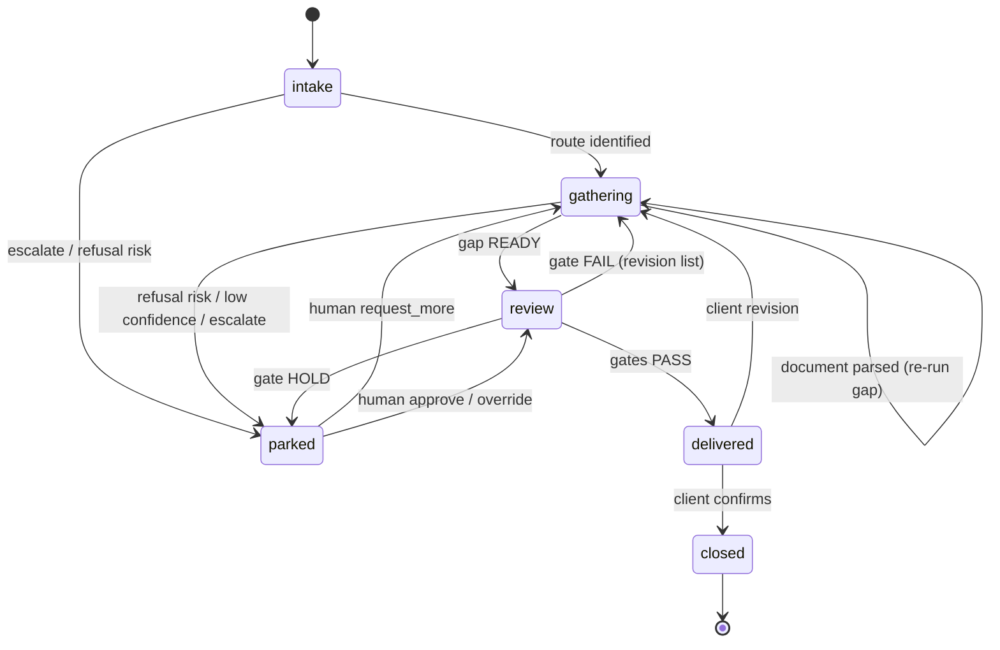
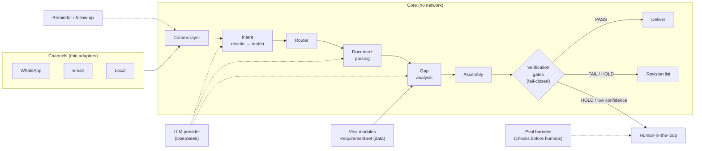

# uk-visa-consultant

A **human-like UK visa application consultant agent**. It interacts over WhatsApp and email the way a human consultant would — intake, document gathering, gap analysis, and final assembly of a submission-ready application package — and **delivers the result**, not just advice.

Built **delivery-stability-first**: every agent boundary uses structured output, every deliverable passes a fail-closed verification gate before it ships, and every claim carries provenance. The core is channel-agnostic and fully testable over a **local message loop** (no network) before any WhatsApp/email integration exists.

> **Status:** in implementation, **stable and demo-ready** — `92` unit/regression tests, `20/20` workflow eval, `106/106` intake backtest, and `20/20` real-email corpus flows, all green. Email is live-tested with PDF and image attachments; WhatsApp outbound is live-tested.

---

## The two deliverables

1. **The product** — a consultant agent that takes a client from *"I want a UK visa"* to a complete, checked application package (form data, document checklist, cover letter, indexed supporting documents).
2. **The thesis** — how to make AI delivery stable: agent selection, workflow design, structured outputs, evaluation gates, exact-intent recovery, and human escalation. Written up in [`docs/STABILITY.md`](docs/STABILITY.md).

## Quick start

```bash
git clone https://github.com/fengweit/uk-visa-consultant.git
cd uk-visa-consultant
uv sync                       # Python 3.11+, uv-managed
cp .env.example .env          # fill credentials (see Setup)

# Local demo — zero credentials, zero network
uv run python scripts/demo.py

# Full gateway — email (IMAP poll) + WhatsApp (webhook) + health endpoint
uv run python scripts/run_gateway.py
```

---

## Agent workflow — a case state machine

The pipeline below is the **data flow**. The system is driven by a **case state machine** where each state is owned by exactly one agent — full design in [`docs/AGENT-WORKFLOW.md`](docs/AGENT-WORKFLOW.md).



| State | Owning agent | Purpose | Built |
|---|---|---|---|
| `intake` | IntakeAgent | identify client + visa route, first documents | ✅ |
| `gathering` | GapAgent | collect docs, run gap analysis, request missing | ✅ |
| `review` | AssemblyAgent | assemble package, run verification gates | ✅ |
| `delivered` | DeliveryAgent | ship package, handle revisions | ✅ |
| `parked` | HumanReview | escalation: a human decides | ⬜ |
| `closed` | — | terminal | ⬜ |

Cross-cutting: **ReminderAgent** (scheduler) fires on deadlines — not yet built (see back-check).

### Pipeline (data flow)



---

## Visa routes & corpus cases

Four routes, each a self-contained `RequirementSet` (data, with verified thresholds). The **corpus** (`data/corpus/`, generated by `scripts/generate_corpus.py`) exercises each route with **20 cases / 106 documents** across five scenario families — used to backtest the whole workflow.

| Route | Mandatory checks (enforced) | Verified thresholds |
|---|---|---|
| **Visitor** | passport (presence + expiry + scanned), funds, accommodation | passport valid for stay |
| **Student** | passport, CAS (name-consistency), maintenance funds | £1,171/mo outside London × 9 = **£10,539** |
| **Worker** | passport, CoS (name-consistency), English, maintenance funds | **£1,270** (28-day) |
| **Spouse** | passport, marriage cert (name-consistency), sponsor income, English, genuine-relationship evidence | **£29,000** income |

### Scenario families (what the corpus tests)

The 20 corpus cases are grouped into **6 scenario families** — each one is a specific way a real application goes wrong, and each asserts the agent produces the correct verdict. A **verdict** is the status the agent computes for a requirement (`READY` / `MISSING` / `INVALID` / `INCONSISTENT` / `EXPIRING`) — it is *calculated* from the documents, never generated by a model.

| # | The situation (what's wrong with the application) | The agent must reply | Example case |
|---|---|---|---|
| 1 | **Everything correct** — every required document present and valid | "…ready to submit" (`READY`) | `student_001_complete` |
| 2 | **A required document is missing** | names the missing doc (`MISSING`) | `student_002_missing_cas` |
| 3 | **Funds too low** — bank balance under the threshold, or dips below it during the 28-day window | "funds below required £X" (`INVALID`) | `student_003_funds_insufficient`, `student_004_funds_28day_violation` |
| 4 | **Names don't match** — passport says one name, the CAS/CoS/marriage certificate says another | "name mismatch: 'X' vs 'Y'" (`INCONSISTENT`) | `student_005_name_mismatch` |
| 5 | **Passport expires before the stay ends** | flags the expiry date (`EXPIRING`) | `visitor_004_passport_expiring` |
| 6 | **Document is image-only** (a scan/photo with no text layer) | "scanned — needs OCR" (`INVALID`) | `visitor_005_scanned_passport` |

**How to read a case name:** `{route}_{number}_{scenario}` — so `student_002_missing_cas` = Student route, case #2, the "missing CAS" scenario. Full list: `visitor_{001..005}`, `student_{001..005}`, `worker_{001..005}`, `spouse_{001..005}`.

**How each case is verified:** every case stores a ground-truth `expected` outcome in its `case.json` (`expected.status` + the exact `gap_items` with `req_id` + `verdict`). The test runs the case through the pipeline and asserts the agent's reply matches that ground truth — a case only passes if the *correct* verdict lands on the *correct* requirement. The example conversations in the [Examples](#examples) section show what these replies look like verbatim.

---

## Behaviors (what each module does)

- **Intent recognition** (`intents/`) — rewrite → rule-first match over a versioned keyword taxonomy (7 intents: `submit_document`, `document_query`, `gap_question`, `status_check`, `schedule`, `escalate_human`, `general`). A question-boost disambiguates "do I need a TB test?" (query) from "here is my passport" (submit). Deterministic rules first; LLM hook for the long tail.
- **Document parsing** (`parsing/`) — `pdf-inspector` (Rust) classifies each PDF (`text_based`/`scanned`/`image_based`/`mixed` + confidence) and extracts native text/markdown. JPG/PNG attachments use local macOS Vision OCR (fail-closed when unavailable), then DeepSeek converts the OCR text into the typed field schema. A deterministic "Label: Value" fallback remains only for the synthetic corpus; `claimed_type` preserves a scanned document's type from the client's message.
- **Gap analysis** (`gaps/`) — `Documents × RequirementSet → GapReport`. Verdicts are **computed, never model-generated**: presence, funds/income thresholds, name consistency, expiry, scanned. Standard `GapReport` format.
- **Assembly + gates** (`workflow/`) — static `Package` (form data, checklist, cover letter) then five fail-closed gates: `gap.ready`, `mandatory.all`, `form.complete`, `funds.window` (31-day), `passport.validity` (unprocessed scan → HOLD; successfully OCR'd image continues). `PASS` ships; `FAIL`/`HOLD` blocks; unverifiable is `HOLD`, never `PASS`.
- **Gateway** (`gateway/`) — the channel-agnostic loop. Stateful per client: infers the route, accumulates documents, runs the supervisor, and replies with real gap feedback ("you still need X"). WhatsApp webhook (HMAC signature verify, fail-closed) + email IMAP poll both route through it.

---

## Examples

These are **real email round-trips** through the live gateway (client `fengweit@gmail.com` ↔ agent `fengwei.demo.uk.visa@gmail.com`) with real PDF attachments. The agent's replies are verbatim — an interviewer can paste any of these exchanges and reproduce the exact behavior.

### A real downloaded email (verbatim headers)

An actual reply pulled from the client's inbox. Note the threading headers (`In-Reply-To` / `References`) — this is what keeps the conversation in one thread and never spawns new ones:

```
From:        fengwei.demo.uk.visa@gmail.com
To:          fengweit@gmail.com
Subject:     Re: e2e-student-complete
In-Reply-To: <e2e-student-complete-d4@e2e>
References:  <e2e-student-complete-d4@e2e>

All your documents are verified — your application package is ready to submit.
```

### 1. Complete application — Student Route → ready

```
You:     I want a student visa
Agent:   I can help with your Student Route application. You'll need: passport, cas,
         maintenance funds (28-day). Attach them here and I'll check each one.

You:     here is my passport            [attached: passport.pdf]
Agent:   I've checked your documents. Still outstanding:
           • CAS: Provide your cas.
           • Maintenance funds (28-day): Provide your maintenance funds (28-day).

You:     here is my bank statement      [attached: bank_statement.pdf]
Agent:   I've checked your documents. Still outstanding:
           • CAS: Provide your cas.

You:     here is my cas                 [attached: cas.pdf]
Agent:   All your documents are verified — your application package is ready to submit.
```

### 2. Missing a mandatory document — Student → MISSING

```
You:     I want a student visa
Agent:   I can help with your Student Route application. You'll need: passport, cas,
         maintenance funds (28-day)…

You:     here is my passport            [attached: passport.pdf]
Agent:   I've checked your documents. Still outstanding:
           • CAS: Provide your cas.
           • Maintenance funds (28-day): Provide your maintenance funds (28-day).
```

### 3. Insufficient funds — Student → INVALID

```
You:     here is my bank statement      [attached: bank_statement.pdf, balance £8,000]
Agent:   I've checked your documents. Still outstanding:
           • Passport: Provide your passport.
           • CAS: Provide your cas.
           • Maintenance funds (28-day): Funds below required £10,539.
```

### 4. Name mismatch — Worker → INCONSISTENT

```
You:     I want a worker visa
Agent:   I can help with your Skilled Worker application. You'll need: passport, cos,
         english language, maintenance funds…

You:     here is my cos                [attached: cos.pdf, worker "Janet Doe"]
Agent:   I've checked your documents. Still outstanding:
           • CoS: Name mismatch: 'Janet Doe' vs passport 'Jane Doe'.
```

### 5. Scanned (image-only) passport — Visitor → needs OCR

```
You:     I want a visitor visa, staying until 2026-10-05
Agent:   I can help with your Standard Visitor application. You'll need: passport,
         proof of funds, accommodation…

You:     here is my passport           [attached: scanned/image-only passport.pdf]
Agent:   I've checked your documents. Still outstanding:
           • Passport: Scanned document needs OCR.
```

### 6. Passport expiring mid-stay — Visitor → EXPIRING

```
You:     I want a visitor visa, staying until 2026-10-05
Agent:   I can help with your Standard Visitor application…

You:     here is my passport           [attached: passport.pdf, expires 2026-09-25]
Agent:   I've checked your documents. Still outstanding:
           • Passport: Expires 2026-09-25, before stay end 2026-10-05.
```

### 7. Real image passport — OCR + DeepSeek + live email

The repository includes [`examples/documents/fake-passport.jpg`](examples/documents/fake-passport.jpg), a deliberately fake UK passport image. The live test sends it from the client Gmail account to the agent Gmail account, runs local Vision OCR, asks DeepSeek for schema-valid passport fields, and reads the reply back from the client inbox.

```text
Extracted: DOE JOHN · passport 537856940 · DOB 1986-07-16
           expiry 2026-05-22 · BRITISH CITIZEN

Agent:     I've checked your documents. Still outstanding:
           • Proof of funds: Provide your proof of funds.
           • Accommodation: Provide your accommodation.
```

The test asserts that the reply does **not** say “passport missing” or “needs OCR”. Run `uv run python scripts/e2e_real_passport.py` (requires both Gmail test accounts and `DEEPSEEK_API_KEY`).

---

## Architecture

Canonical data model (see `src/uk_visa_consultant/models.py`): `Message`, `Client`, `Case`, `Intent`, `Document`, `RequirementSet`, `GapReport`, `Package`, `VerificationResult` — every module boundary exchanges these typed records.

```
src/uk_visa_consultant/
├── models.py              # canonical types (pydantic)
├── llm.py                 # LLMClient + DeepSeekLLMClient + StubLLMClient + get_llm()
├── agent.py               # IntakeAgent (intent → intake)
├── visas.py               # RequirementSet data for 4 routes
├── config.py              # load_env()
├── channels/              # local / email / whatsapp adapters
├── intents/               # intent recognition
├── parsing/               # pdf-inspector intake + profiles + fields
├── gaps/                  # gap analysis
├── workflow/              # assembly + gates + CaseSupervisor
├── gateway/               # Gateway loop + FastAPI server
└── evals/                 # harness (promotion bar)
```

---

## Setup

### Email (Gmail, ~15 min)

1. Enable **2-Step Verification**, then create an **App Password** (Security → App passwords → "Mail").
2. Enable **IMAP** (Gmail → Forwarding and POP/IMAP → Enable IMAP).
3. Fill `.env`: `EMAIL_IMAP_PASSWORD=***` (the account, hosts, and ports are pre-filled).

### WhatsApp (Meta Cloud API)

1. Meta developer app → add the **WhatsApp** product → **API Setup** → get a **test number** (instant) or real WABA.
2. Grab the **temporary access token**, **Phone Number ID**, and **App Secret**; pick a **verify token**.
3. Expose the webhook: `cloudflared tunnel --url http://localhost:8000` → set the callback URL to `https://<tunnel>/webhooks/whatsapp` + your verify token → subscribe to the `messages` field.
4. Fill `.env`: `WHATSAPP_ACCESS_TOKEN`, `WHATSAPP_PHONE_NUMBER_ID`, `WHATSAPP_APP_SECRET`, `WHATSAPP_VERIFY_TOKEN`.

Full walkthrough: [`docs/setup-channels.md`](docs/setup-channels.md).

### DeepSeek (LLM extraction)

Put `DEEPSEEK_API_KEY=***` in `.env`; `get_llm()` then uses DeepSeek for schema-valid field extraction. DeepSeek is text-only: `pdf-inspector` extracts native PDF text first, while JPG/PNG attachments use local macOS Vision OCR before the text is sent to DeepSeek. If OCR or schema validation fails, the document remains incomplete—values are never guessed.

---

## Testing & stability

```bash
uv run pytest -q                               # 92 unit/regression tests
uv run python scripts/eval_workflow.py         # 20/20 workflow eval (PROMOTED)
uv run python scripts/backtest_agent.py        # 106/106 agent backtest
uv run python scripts/backtest_intake.py       # 106/106 intake backtest
uv run python scripts/e2e_email_real.py all    # 20/20 real Gmail + PDF corpus flows
uv run python scripts/e2e_real_passport.py     # live JPG → OCR → DeepSeek → Gmail reply
```

**Stability guarantees** (verified, not assumed):
- **Deterministic** — identical inputs → byte-identical outputs (no model nondeterminism in the spine).
- **Fail-closed** — tampered WhatsApp webhooks are dropped; any gate `FAIL`/`HOLD` blocks delivery; SMTP transport errors return `ok=False`, never silently lost.
- **Idempotent** — email polling marks seen + persists a seen-set, so re-polling never re-processes a message.
- **No partial shipping** — a package passes all gates or is not delivered.

---

## Requirements back-check

| Initial requirement | Status |
|---|---|
| WhatsApp/email consultant agent that delivers the final package | ✅ gateway + workflow |
| Solve AI delivery stability (agent selection + workflow design) | ✅ `docs/STABILITY.md` + deterministic spine + fail-closed gates |
| GitHub repo submission | ✅ |
| 4 visa routes, each its own module | ✅ `visas.py` + `docs/visas/` |
| Separate information/communication (network) layer | ✅ `channels/` + `gateway/` |
| Intent recognition (rewrite + matching) | ✅ `intents/` |
| Document parsing (pdf library → pdf-inspector) | ✅ `parsing/` |
| Gap analysis with a standard pattern/format | ✅ `gaps/` |
| Static assembly → delivery → revision loop with checks before sending | ✅ `workflow/` |
| **Reminder / follow-up** | ⬜ spec only (`docs/specs/reminder-followup.md`) |
| **Human-in-the-loop after harness checks** | ⬜ `parked` state exists; HITL handler not yet built |

---

## Compliance note

UK immigration **advice** is regulated by the OISC. This project is positioned as **document preparation and assembly** — collecting, parsing, checking, and packaging materials against published requirements — not as legal advice. Production use requires an advice boundary, client disclaimers, and (where applicable) OISC registration. Requirement values are verified against gov.uk (as of 2026-09) and should be re-sourced before production.
