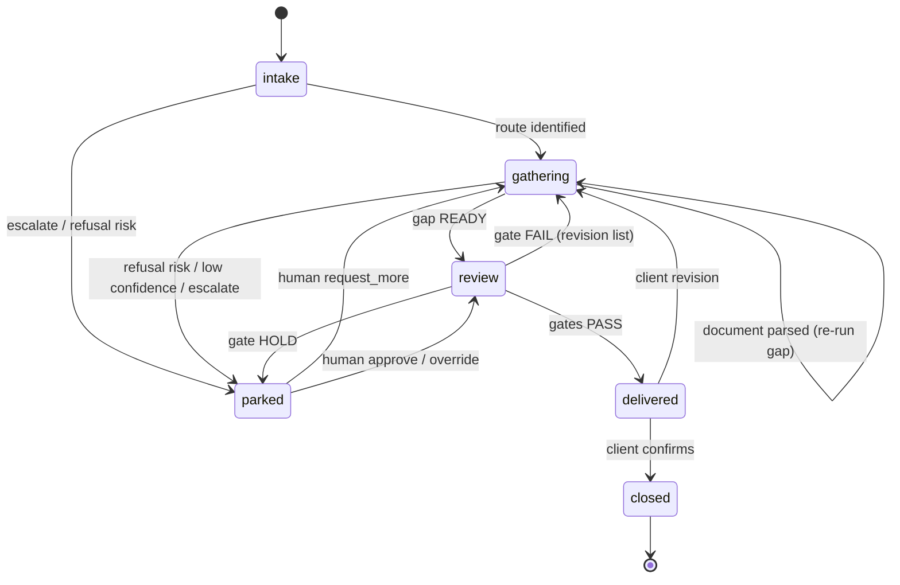

# Agent workflow — case state machine

The control layer the whole system runs on. Lock this down before any deeper
integration: a **case is a finite-state machine**, each state is owned by exactly
one **agent**, and a deterministic **supervisor** routes events and applies
transitions. Agents reason *within* a state; they never decide the flow.

## Why a state machine, not a linear pipeline

A linear pipeline ("intent → parse → gap → assemble → deliver") hides the fact
that a real consultation is a loop: a client sends a document, gets told what's
still missing, sends another, hits a refusal-risk flag, a human steps in, the
client revises, and only then does anything ship. Those are **states**, and each
needs different behaviour. Encoding them as states — instead of letting "the
agent figure it out" — is what makes delivery stable and auditable.

## States

| State | Owning agent | Purpose | Built |
|---|---|---|---|
| `intake` | IntakeAgent | identify client + visa route, first documents | ✅ |
| `gathering` | GapAgent | collect docs, run gap analysis, request what's missing | ⬜ |
| `review` | AssemblyAgent | assemble the package, run verification gates | ⬜ |
| `delivered` | DeliveryAgent | ship the package, handle revision requests | ⬜ |
| `parked` | HumanReview | escalation: a human decides, the agent applies it | ⬜ |
| `closed` | — | terminal | ⬜ |

Cross-cutting: **ReminderAgent** (scheduler) fires on deadline events in any
non-terminal state. It is not a state owner.

## Events

Inbound events drive transitions:

- `MESSAGE` — a client message with a recognized `Intent`
- `DOCUMENT_PARSED` — an attachment became a `Document`
- `GAP_COMPUTED` — gap analysis produced a `GapReport`
- `GATE_RESULT` — a verification gate returned PASS / FAIL / HOLD
- `HUMAN_RESOLUTION` — a human resolved a parked case (approve / request_more / override)
- `CLIENT_CONFIRM` — client confirms the delivered package
- `TIMEOUT` — client unresponsive past a grace period

## Transition table

| From | Event | To |
|---|---|---|
| `intake` | route identified | `gathering` |
| `intake` | document parsed (route still unknown) | `intake` |
| `intake` | escalate / refusal-risk | `parked` |
| `gathering` | document parsed | `gathering` (re-run gap) |
| `gathering` | gap → READY | `review` |
| `gathering` | gap → refusal-risk / low confidence | `parked` |
| `gathering` | escalate | `parked` |
| `review` | all gates PASS | `delivered` |
| `review` | gate FAIL | `gathering` (return revision list) |
| `review` | gate HOLD | `parked` |
| `delivered` | client revision request | `gathering` |
| `delivered` | client confirms | `closed` |
| `parked` | human approve / override | `review` (re-run gates) |
| `parked` | human request_more | `gathering` |
| any non-terminal | TIMEOUT | nudge via ReminderAgent, then `parked` |

## State machine (diagram)



## Invariants (delivery stability)

1. **One owner per state** — a state has exactly one handling agent; accountability
   is unambiguous and each state is testable in isolation.
2. **Transitions are code, not model output** — the supervisor is deterministic; a
   model never decides to move a case.
3. **`review` entry requires `GapReport.status == READY`** — you cannot assemble from gaps.
4. **`delivered` entry requires all gates PASS** — fail-closed; no partial shipping.
5. **`parked` entry creates an escalation with a provenance bundle** — a human never
   reviews without context.
6. **`override` never skips gates** — a human changes a *decision input*, not the
   fail-closed gate logic.
7. **Ambiguous → `parked`, never guessed** — exact-intent recovery; no compensating mutation.

## Supervisor contract

```
CaseSupervisor.on_event(case, event) -> (next_state, handler, actions[])
```

The supervisor (1) validates the transition against the table, (2) dispatches the
event to the current state's owning agent, (3) persists the new state, (4) returns
the ordered actions (messages to send, gates to run). An invalid transition is
fail-closed — it parks the case rather than proceeding.

## How each agent fits (built + planned)

- **IntakeAgent (built)** — handles `intake`: recognizes intent, parses any attached
  documents, identifies the visa route, and emits `route identified`.
- **GapAgent (next)** — handles `gathering`: `Documents × RequirementSet → GapReport`,
  and turns gaps into concrete "you're missing X" actions.
- **AssemblyAgent** — handles `review`: assemble the `Package`, run the gates.
- **DeliveryAgent** — handles `delivered`: ship, and accept revision requests back to
  `gathering`.
- **HumanReview** — handles `parked`: present the escalation bundle, apply the human's
  resolution *through the supervisor* (never by direct mutation).
- **ReminderAgent** — cross-cutting scheduler; emits reminders, can trigger `TIMEOUT`
  → `parked`.

## Pattern name

This is **supervisor + finite-state specialist agents**: an orchestrator pattern
where the finite-state machine is the deterministic spine and each specialist is
an LLM-bound reasoning unit scoped to one state. It is the mechanism that makes
the `docs/STABILITY.md` principles (deterministic control flow, fail-closed gates,
provenance, escalation-as-a-state) concrete.
