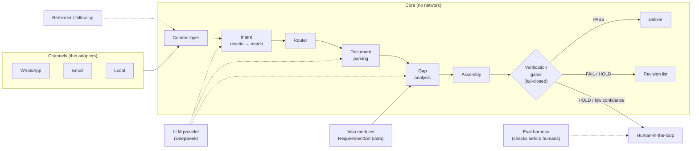
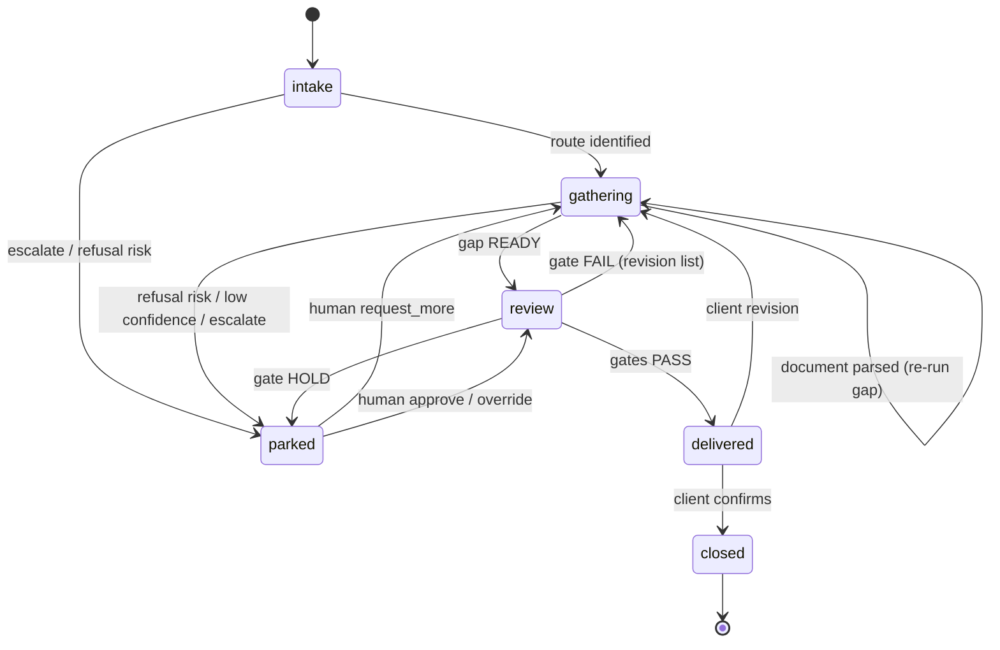

# Architecture

## Design principle

**The core is channel-agnostic and testable without a network.** WhatsApp and email are thin adapters over a canonical `Message` type; a `Local` adapter feeds messages straight from a test script so the full loop (intent → parse → gap → assemble → verify) runs in-process. Channel integration is built and tested **separately**, exactly as a network layer would be.

## Data model (canonical types)

All module boundaries exchange typed records. Each type has a JSON Schema; LLM outputs are parsed and validated against it (see `docs/STABILITY.md`).

```
Message         { id, client_id, channel, ts, body, attachments[] }
Client          { id, contact: {phone?, email?}, visa_type, profile }
Case            { id, client_id, state, docs: Document[], gaps: GapReport?, package: Package? }
Intent          { intent, confidence, slots{}, rewrite_of, matched_rule }
Document        { id, type, source_path, fields{}, provenance{}, quality, flags[] }
RequirementSet  { visa_type, route, required_docs[], financial[], checks[], cover_template }
GapReport       { visa_type, status, items[]: {doc_id, req_id, verdict, reason, evidence, action} }
Package         { client_id, form_data{}, checklist[], cover_letter, supporting: Document[], checks: VerificationResult[] }
VerificationResult { check_id, verdict: PASS|FAIL|HOLD, evidence, provenance }
```

## Pipeline



## Case state machine & agent workflow

The pipeline above is the **data flow**. The **control flow** is a case state
machine — full design in [`docs/AGENT-WORKFLOW.md`](AGENT-WORKFLOW.md).



**Implementation status** (built ✅ / spec-only ⬜):

| Module | Status |
|---|---|
| Comms layer (`channels/`) | ✅ |
| Intent recognition (`intents/`) | ✅ |
| Document parsing (`parsing/`) | ✅ |
| IntakeAgent (`agent.py`) | ✅ |
| Eval harness (`evals/`) | ✅ |
| Gap analysis | ⬜ spec |
| Assembly / gates / deliver | ⬜ spec |
| Reminder / follow-up | ⬜ spec |
| Human-in-the-loop | ⬜ spec |

### 1. Comms layer (`docs/specs/comms-layer.md`)

- `ChannelAdapter` interface: `receive() -> Message`, `send(Message)`, `send_media(path)`.
- Implementations: `LocalAdapter` (first, for loop testing), `WhatsAppAdapter` (Meta Cloud API), `EmailAdapter` (IMAP/SMTP).
- Normalizes channel-specific payloads into a canonical `Message`; resolves client identity across channels (phone ↔ email linkage) into one `client_id`.
- Deliberately no business logic — it is transport only.

### 2. Intent recognition (`docs/specs/intent-recognition.md`)

Two stages:
- **Rewrite** — normalize slang/typos/noise into a canonical statement (few-shot LLM, deterministic fallback).
- **Match** — map the rewritten statement against an intent taxonomy (rule-first, LLM for the long tail) → `Intent` with slots.

Router consumes the `Intent` and dispatches to a specialist: `document_query`, `submit_document`, `status_check`, `schedule`, `gap_question`, `general`, `escalate_human`.

### 3. Document parsing (`docs/specs/document-parsing.md`)

- `pdf-inspector` (Rust) for classification (`text_based`/`scanned`/`image_based`/`mixed` + confidence) and text/markdown extraction; selective OCR is deferred (records `pages_needing_ocr`).
- Emits a structured `Document` — typed fields keyed by document type (passport → number/name/DOB/expiry; bank statement → balances/dates; employment letter → employer/dates/salary), plus provenance (source file, page, extraction confidence) and flags (scanned, low-quality, tamper suspicion).
- Middle-layer reuse: a document "profile" declares fields + extraction hints so new doc types are added by data, not code.

### 4. Gap analysis (`docs/specs/gap-analysis.md`)

- `Documents × RequirementSet → GapReport`. Every requirement is checked: **presence** (doc supplied?), **value** (field populated correctly?), **applicability** (does this rule apply to this client?).
- Output is a **standard pattern/format** (see spec) — deterministic verdicts (`OK` / `MISSING` / `INVALID` / `EXPIRING` / `INCONSISTENT`) with evidence + the specific action the client must take.
- Few-shot examples drive the LLM; the requirement rules themselves are data in the visa module, not model judgment.

### 5. Assembly → verification → deliver/revision (`docs/specs/assembly-delivery-revision.md`)

- **Assembly** is static/deterministic: completed form data + document checklist + cover letter + indexed supporting docs → `Package`.
- **Verification gates** (fail-closed) run before anything leaves: every mandatory doc present and valid, cross-doc consistency (name/DOB match), funds window, no unanswered form field. Any `HOLD`/`FAIL` blocks delivery.
- **Deliver/revision** is a static loop: ship on full pass, otherwise return a precise revision list. No partial shipping.

### 6. Reminder / follow-up (`docs/specs/reminder-followup.md`)

- Functional scheduler keyed off case deadlines (biometrics, funds-window expiry, document expiries).
- Emits reminder messages through the comms layer. Deterministic triggers; no model in the hot path.

### 7. Eval harness (`docs/specs/eval-harness.md`)

- Golden sets per module (intent pairs, document fixtures, gap-report fixtures) + verification-gate fixtures.
- Runs **before** human-in-the-loop is enabled: a module is promoted to HITL only after its harness passes. This is the "checks before humans" ordering.

### 8. Human-in-the-loop (`docs/specs/human-in-the-loop.md`)

- Escalation policy: low confidence, refusal-risk flags, form-answer changes, or any `HOLD` gate → route to a human consultant with full provenance attached.
- The agent never asserts a legal conclusion it cannot source; ambiguous mutations hold, never ship.

## Visa modules

Each route under `docs/visas/` is a `RequirementSet` (data), so adding a route = adding a module file, not touching pipeline code. See `docs/visas/*.md`.

## Model provider

All LLM calls go through a provider abstraction (`LLMClient` with `complete(prompt, schema) -> validated`). Target is **DeepSeek** via its OpenAI-compatible endpoint (`https://api.deepseek.com`, model `deepseek-chat`), configured from env. The abstraction keeps the harness runnable with a stub provider (deterministic canned responses) so the whole loop is testable **before** any API key exists.
